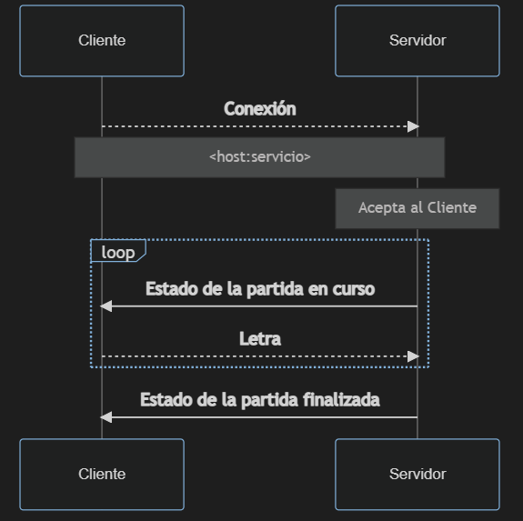
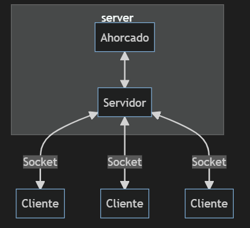

# TP1
## Taller de Programación FIUBA 2021 2C
## Manuel Reberendo 100930
<br>
<br>

# Introducción
El trabajo consiste en programar un juego del *Ahorcado* en linea, es decir:
- Un servidor que tendrá un repositorio de palabras a adivinar y que atenderá a un cliente a la vez para que intenten adivinarlas hasta que se acaben.
- Un cliente que podrá conectarse al servidor para jugar, mostrando por salida estándar una interfaz del juego, y pudiendo ingresar letras que se enviarán al servidor de forma secuencial, hasta que adivine la palabra (victoria) o se le acaben los intentos (Derrota)  
  
El siguiente diagrama muestra el flujo de interacciones típicas entre un cliente y el servidor en el desarrollo de una partida:

# TDAs
Para estructurar el código de la aplicación, se encapsulan en Tipos de Dato Abstractos algunos componentes con comportamientos distiguidos.
A continuación, un resumen de ellos, sus funciones principales y sus interacciones:
## Ahorcado
Representa una partida de Ahorcado. Contiene la lógica del juego. Una partida comienza con una palabra a adivinar y un número máximo de intentos permitidos, y termina cuando la palabra es adivinada o se acaban los intentos.
Su interfaz es simple, y la función más relevantes es:
```c
void ahorcado_adivinar(ahorcado_t *self, char letra){
    if (self->juego_finalizado == true){
        //Si el juego ya terminó, no puede seguir adivinando
        return; 
    }
    bool acierto = false;
    for (int i = 0; i < strlen(self->palabra); i++){
        if (self->palabra[i] == letra){
            self->palabra_adivinada[i] = letra;
            acierto = true;
        }
    }
    if (strcmp(self->palabra_adivinada,self->palabra)==0){
        //Si la palabra adivinada es igual a la palabra, entonces ganó.
        self->juego_finalizado = true;
        self->victoria = true;
        return;
    }
    if (acierto == false){
        //Si no acertó, se descuentan intentos
        self->intentos = self->intentos - 1;
        if (self->intentos == 0){
            self->juego_finalizado = true;
        }
    }
}
```
Que simplemente recibe una letra, y actualiza el estado del juego en base a si la letra se encuentra o no en la palabra a adivinar.

## Socket
Encapsula la creacion de conexiones mediante sockets TCP y el envío y recepción de información utilizandolos.  
Tanto Clientes como Servidor los utilizan para comunicarse entre si.  
Entre sus funciones más relevantes se encuentran `socket_recibir` y `socket_enviar`.
Ambas muy similares ya que su principal diferencia está en el uso de `recv()` y `send()` respectivamente, y ambas poseen la problematica de los *short reads y writes*, que solucionan mediante el uso de bucles, que verifican que la información se envie o reciba en múltiples instancias hasta que la cantidad todal de bytes esperados se complete.
Otra cuestión que deben resolver ambas es el hecho de que un envío puede fallar repetidas veces, por lo que debe implementarse un mecanismo de reintentos.
A continuación se muestra, como ejemplo de lo mencionado, la función `socket_enviar()`:
```c
ssize_t socket_enviar(socket_t *self, const char *buffer, size_t longitud){    
    ssize_t bytes_enviados_totales = 0;    
    int reintentos = 0;
    while ((bytes_enviados_totales < longitud) 
            && (reintentos <= MAX_REINTENTOS)){
        ssize_t bytes_enviados = send(self->file_descriptor,
                              &buffer[bytes_enviados_totales],
                              longitud - bytes_enviados_totales,
                              MSG_NOSIGNAL);
        if (bytes_enviados != -1){ // Si no hay error en el envío
            reintentos = 0;
            bytes_enviados_totales += bytes_enviados;
        } else {
            reintentos += 1;
        }
    }    
    return bytes_enviados_totales;
}
```
## Cliente
Representa a un cliente jugador. Pertenece al archivo `client.c`, cuya función `main()` es el punto de entrada para iniciar un juego del lado del cliente.  
Se comunica con el servidor mediante sockets al *host* y *servicio* indicados en su creación.  
Sus responsabilidades son, basicamente, la de enviar las letras para adivinar la palabra al servidor, y la de mostrar por salida estandar la interfaz del juego, utilizando la información recibida del servidor sobre el estado del mismo. Esto último lo logra mediante llamadas a la siguiente función:
```c
void cliente_recibir_estado(cliente_t *self){
    uint8_t primer_byte = 0;
    uint16_t longitud_mensaje;
    char * palabra;
    socket_recibir(&self->socket, (char*)&primer_byte, 1);
    socket_recibir(&self->socket, (char*)&longitud_mensaje, 2);
    longitud_mensaje = ntohs(longitud_mensaje);
    palabra = calloc(longitud_mensaje + 1, sizeof(char));
    socket_recibir(&self->socket, palabra, longitud_mensaje);
    if (primer_byte >= 128){ //La partida terminó
        self->juego_terminado = true;
        if (primer_byte==128){ //No quedaban intentos: perdió
            printf("Perdiste! La palabra secreta era: '%s'\n",palabra);
        } else {
            printf("Ganaste!!\n");
        }
    } else{
        printf("Palabra secreta: %s\n", palabra);
        printf("Te quedan %d intentos\n",primer_byte);
        printf("Ingrese letra:\n");
    }
    free(palabra);
}
```
Se destaca en la función la implementación en la recepción del protocolo de comunicación de mensajes del servidor pedido por consigna, donde el primer byte contiene información sobre si la partida finalizó y los intentos restantes, y el segundo y tercer byte contiene la longitud de la palabra a adivinar (o la palabra completa si el juego ya finalizó). A partir de esta longitud, se reserva memoria para albergar la palabra y se la recibe (y guarda) en el buffer `char * palabra`.

## Servidor
Representa a un servidor que hostea tantos juegos de Ahorcado como palabras en el repositorio indicado en su creacion.  
Se encuentra en el archivo `server.c`, cuya función `main()` es el punto de entrada para iniciar el servidor.  
Se comunica (al igual que el cliente) con los clientes mediante sockets al *host* y *servicio* indicados en la creación de cada cliente. 
Solo puede atender un cliente a la vez, creando un nuevo Ahorcado por cada uno de ellos. Al finalizar, imprime por salida estandar un resumen de las partidas realizadas. 
Al igual que el cliente, debe implementar el protocolo e comunicación indicado por consigna, aunque esta vez en el envío de los mensajes.  
Entre las dificultades que debe sortear el servidor, se encuentra la de verificar que el tamaño de los intentos de la partida entre en los 7 bits que le asigna el protocolo, y que el número que representa la longitud de las palabras a adivinar (y por lo tanto, la longitud de la palabra a adivinar) no supere los dos bytes.  
Nuevamente, la función más relevante es la encargada de la comunicación del estado de la partida, esta vez hacia los clientes:  
```c
void servidor_enviar_datos_cliente(servidor_t *self){
    uint8_t primer_byte = 0;
    char *palabra_a_enviar;

    primer_byte = self->ahorcado.intentos;
    palabra_a_enviar = self->ahorcado.palabra_adivinada;
    if (servidor_juego_finalizado(self) != 0){
        primer_byte += 128;
        palabra_a_enviar = self->ahorcado.palabra;
    }
    socket_enviar(&self->socket_cliente, (char*)&primer_byte, 1);
    unsigned short longitud_palabra = htons(self->ahorcado.longitud_palabra);
    socket_enviar(&self->socket_cliente,
                  (char*)&longitud_palabra,
                  2);
    socket_enviar(&self->socket_cliente,
                  palabra_a_enviar,
                  self->ahorcado.longitud_palabra);
}
```
Es destacable en este caso es que la forma de codificar que en el primer bit vaya un 0 o 1 (Dependiendo si la partida ya finalizó o no) y en los restantes 7 el número de intentos (es decir un total de 8 bits o 1 byte) es almacenando el byte en un `uint8_t` y simplemente sumando 128 a la cantidad de intentos restantes (que no puede superar los 7 bits, es decir, es menor a 128) en caso de que el juego haya terminado.  
Otra cuestión no mencionada en *Cliente*, es el uso de las funciones `htons()` y `ntoh()` para asegurar que se conserve el orden del primer byte del mensaje en cualquier plataforma.

Para finalizar, un diagrama (simplificado) de el uso de todas los TDA mencionados y su relación:


